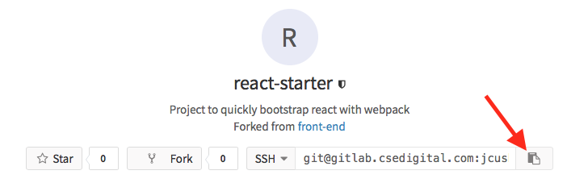
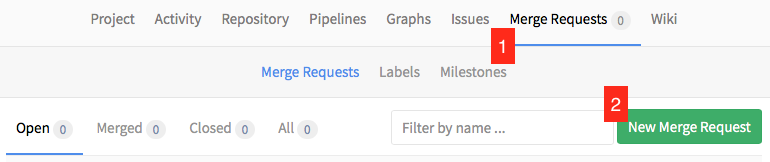
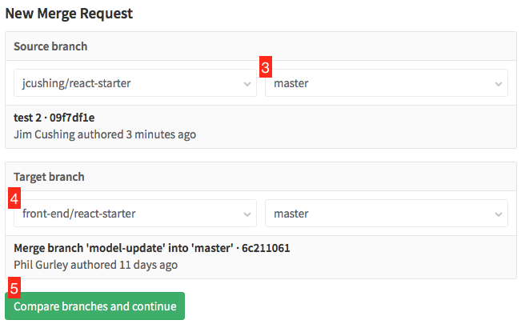

# If/Then ThreeUp Challenge

Since you're here, we'd like for you to build a version of the "Three Up" promo found in the comp below.

Be as creative as you want. Use the existing tools defined later in the README. If you see inefficient code, or a better way to write an existing component feel free to refactor. You should make as many components as you need, and organize, or reorganize code as you see fit.

Don't worry about getting the fonts and spacing exactly right. Let the data in the model at `endpoint/promo-model.json` drive the display.

The component should render on the base page at `http://127.0.0.1:9000/index.html` when the server is launched.

## Getting started

1. Check for an Email for Account Creation email. There’s a potential it went into a spam folder. If you don’t see it, check in spam for an email where the sender is gitlab@csedigital.com and subject is "Account was created for you"
2. Click on link to set password
3. Login with newly set password
4. Set up an SSH key (or use existing key) http://gitlab.csedigital.com/profile/keys
5. If you need help with setting up the SSH key http://gitlab.csedigital.com/help/ssh/README
6. Add key to profile http://gitlab.csedigital.com/profile/keys
7. Fork the repo: http://gitlab.csedigital.com/front-end/react-starter/forks/new
8. When prompted, select yourself to create the fork.
9. Once the fork is created, copy the SSH URL to your fork by clicking the copy icon.

10. Clone repo (git clone <paste the copied URL>)
11. There are usage instructions in the next section of the README to help get you started
12. Push your changes to your fork (git push)
13. When you're ready to share your solution, create a merge request:
	* Click "Merge Requests"
	* Click "New Merge Request"

	* Set "Source Branch" to your master branch (or another branch if you created one)
	* Set "Target Branch" to "front-end/reactor-starter" and "master"
	* Click "Compare branches and continue"

	* On the next screen, enter a title for your pull request and assign to **Phil Gurley** for review.
	* Click "Submit merge request"

## Usage

This repository provides a template to begin developing [React](https://facebook.github.io/react/) based applications using ES6 syntax, using [webpack](https://webpack.github.io/) as a module bundler. Node.js version 6 or newer is required. There is a suite of external node module dependencies - NPM can serve as the package manager.

* git clone git@gitlab.csedigital.com:front-end/react-starter.git
* `cd` into directory
* Run `npm install` to install the dependencies
* Run `npm run build` to build the project
* Run `npm run dev` to build the project, start watching files and run the local server accessible at `http://127.0.0.1:9000`
* Run `npm test` to run the tests once
* Run `npm run test:ci` to watch the `src` directory for changes and run the tests

## Existing Components and utilities

Feel free to modify any of the files listed below as necessary. You should also feel free to make any improvements or optimizations you see fit.

### Javascript
* `src/index.js` Instantiates parent component in index page
* `src/Component.jsx` This is the parent component that is responsible for rendering components on the index page.
* `src/components/js/modules/Image.jsx` This is a simple image component
* `src/components/js/util/fetchEndpoint.js` This is a simple helper function for making XHR requests for JSON.

### SASS
* `src/components/scss/util/_default.scss` Included by parent component
* `src/components/scss/modules/_Image.scss` Contains rules to style the Image component
* `src/components/scss/config/_color.scss` A file that could be used to hold variables, etc

### MISC
* `index.html` Base page
* `endpoint/promo-model.json` Sample model

